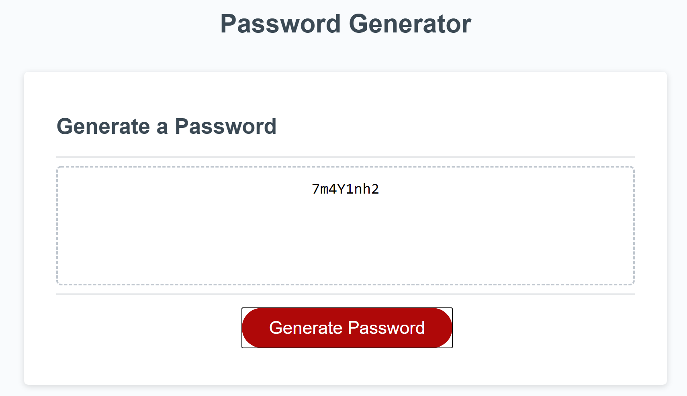

# Password Generator

## About The Repository

### Summary

This repository contains a password generator. This password generator logic utilizes Javascript and allows the user to select password size (8-128 characters inclusive) and what types of characters to include (lowecase, uppercase, number, and special). Based off the user's preferences the web app will generate a new random password each time.

### Error Handling

The password generator will validate each user response and if the response is valid will either add or omit the characters based on the user's preference. If the response is not valid then the prompt will let the user know what the acceptable responses are to allow the use to select another option.

### Available Characters

- Lowercase characters include - "abcdefghijklmnopqrstuvwxyz"
- Uppercase characters include - "ABCDEFGHIJKLMNOPQRSTUVWXYZ"
- Number characters include - "0123456789"
- Special characters include - "!#\$%&+-.:?@^`~"

## Website Mock

Website URL: https://jrkrichards.github.io/password_generator/

### Password Generator:

Start:

Length:

Characters:

End:

